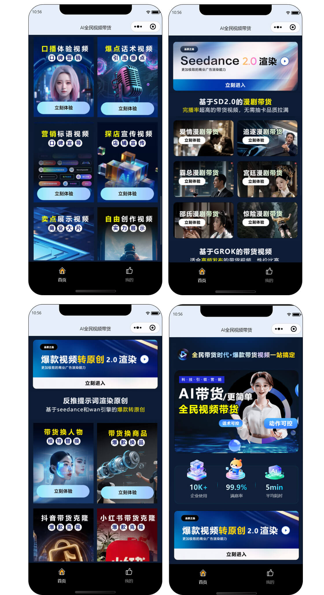
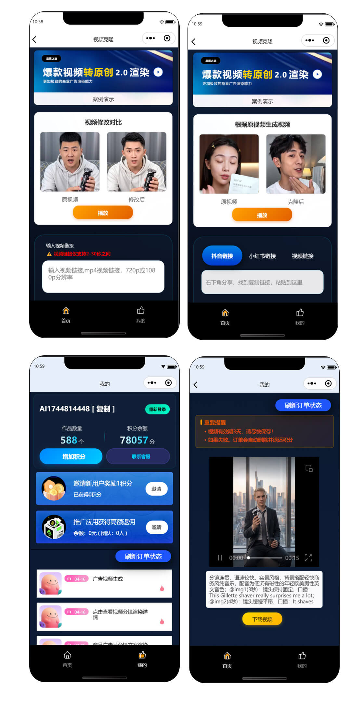

# GPT-image-2 驱动企业转型！云微 AI 视频带货系统，全域流量高效变现

### 一、GPT-image-2 技术革命，企业电商转型新机遇

2026 年，GPT-image-2多模态生成模型的爆发式走红，正为企业电商转型注入核心动力。

它凭借超高清渲染、智能剧情构建、本土化场景适配三大核心优势，彻底解决传统 AI 视频画质模糊、人物失真、内容生硬的行业痛点，产出的带货短剧质感比肩专业实拍，完播率与转化率显著提升。

对于企业商家而言，传统真人拍摄、直播带货模式面临成本高、内卷重、引流难、回本慢等多重困境。

而 GPT-image-2 赋能的 AI 视频带货，无需演员、场地与剪辑团队，零粉丝新号也能撬动自然流量，已成为实体企业、品牌方、线下门店低成本入局短视频电商、实现全域变现的最优解。

### 二、云微 AI 系统深度集成 GPT-image-2，打造企业级带货闭环

作为源头技术厂商，云微 AI 视频带货系统深度搭载 GPT-image-2 核心算力，专为企业商家打造 “内容生产→全域分发→流量转化→数据复盘” 全链路自动化解决方案，彻底告别人工依赖。

#### 1. 全自动批量出片，降本增效 90%
输入产品卖点、品类与风格需求，系统依托 GPT-image-2 自动完成脚本创作、场景生成、人物动画、智能配音、字幕合成，几分钟产出一条 4K 高清带货短剧。

支持批量量产，一键生成几十条差异化视频，适配种草、剧情、测评等多种带货场景，满足企业矩阵号铺量需求。

#### 2. 全域流量覆盖，多平台矩阵变现
系统无缝适配抖音、视频号、快手、小红书等主流短视频平台，支持一键挂载商品链接、批量分发、定时发布。

借助 GPT-image-2 生成的高质感内容，天然契合平台算法，轻松获取自然推荐流量，覆盖白天与深夜全时段用户，全域捕捉潜在客户，打破单一平台流量瓶颈。

#### 3. 企业专属定制，私有化部署更安全
区别于通用工具，云微系统支持私有化部署、完整源码交付、功能二次开发。企业可自定义品牌标识、专属模板、变现模块，打造独立 AI 带货平台；数据本地存储，保障商业信息安全，摆脱第三方平台限制，实现长期稳定运营。

### 三、企业转型核心价值：轻资产、高收益、强壁垒

- **零门槛快速落地**：无需技术团队，可视化操作界面，零基础员工即可上手；当天部署、当天出片、当天开启引流变现，助力企业快速抢占 AI 电商红利窗口期。
- **大幅降低运营成本**：省去演员、场地、设备、剪辑等高额开支，内容产出效率提升 10 倍，单人可管理数十个矩阵账号，人力成本直降 90%。
- **多元变现模式，收益翻倍**：核心收益来自电商带货佣金（5%-30%），爆款视频可持续数月长尾出单；同时支持品牌曝光、私域引流、广告分账等多元变现，构建稳定现金流。
- **构建长期竞争壁垒**：依托 GPT-image-2 技术与源码部署优势，企业可快速迭代功能、创新内容玩法，形成差异化竞争力，摆脱同行低价内卷。

### 四、抓住 AI 风口，企业全域变现正当时

当前，AI 电商已从 “可选项” 变为 “必答题”，GPT-image-2 的技术突破更是将行业推向新高度。对于企业商家而言，观望即落后，入局正当时。

## 🤝 商务微信：ywyy6798

**云微 AI 视频带货系统**，以GPT-image-2 硬核技术 + 成熟落地解决方案 + 全程技术扶持，助力各类企业快速完成 AI 电商转型，批量生产高转化带货视频，全域抢占流量、稳定高效变现。

想要了解系统演示、部署方案、定制开发与合作详情，可随时咨询对接，开启企业 AI 变现新征程。

